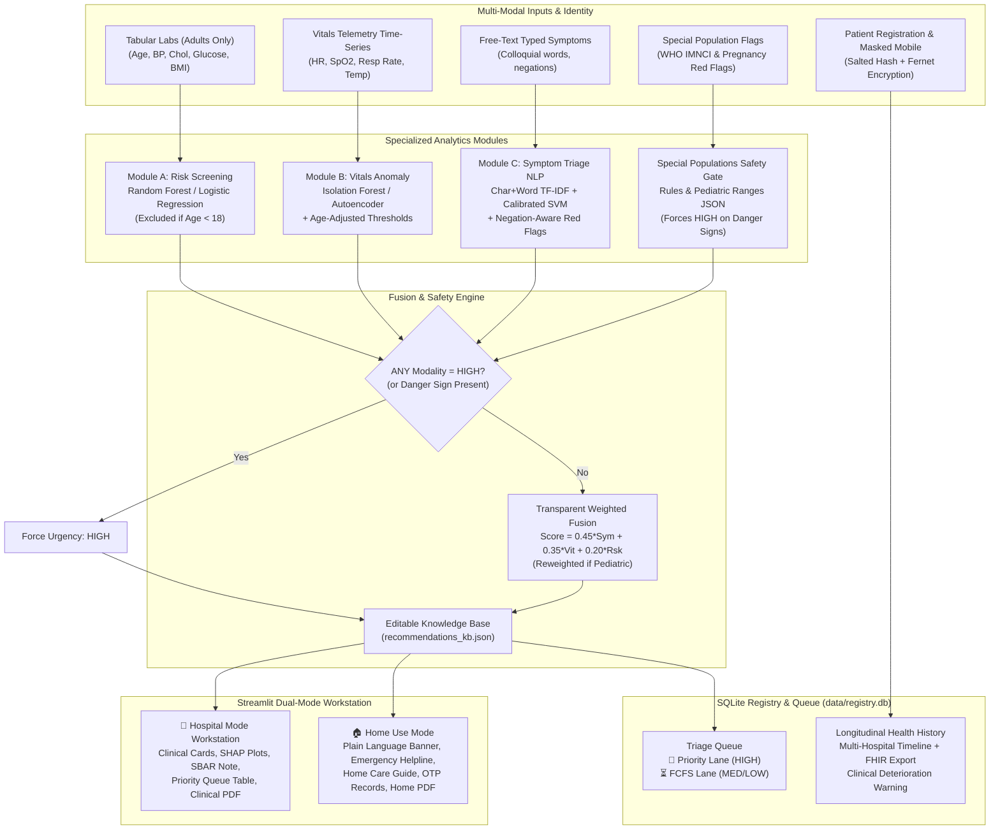

# Multi-Modal AI Medical Triage Dashboard 🏥

> **AI-Powered Clinical Decision-Support Prototype for Rural Healthcare Access**  
> *Aligned with United Nations Sustainable Development Goal 3: Good Health and Well-Being (Target 3.8: Universal Health Coverage)*

---

## 📌 Overview & Clinical Purpose

In rural clinics, primary health centres (PHCs), and community health posts, health workers frequently evaluate patients without on-site physicians. Differentiating mild, self-limiting ailments from occult medical emergencies is critical to saving lives.

The **Multi-Modal AI Medical Triage Dashboard** is a unified, runnable Streamlit application combining:
1. **Module A (Tabular Chronic Risk):** Patient chronic baseline liability for Heart Disease and Type 2 Diabetes with **SHAP feature attribution** (adults only; excluded for pediatrics).
2. **Module B (Time-Series Telemetry):** Continuous vital signs monitoring (Heart Rate, \(\text{SpO}_2\), Respiratory Rate, Temperature) via **Isolation Forest** or **Reconstruction Autoencoder** with **hard clinical safety overrides**.
3. **Module C (NLP Symptom Triage):** Free-text typed symptoms with negation handling (`no chest pain`), typo correction, emergency **red-flag overrides**, and **influential token highlights**.
4. **Special Populations Safety Gate:** Rule-based detection of **WHO IMNCI under-5 pediatric danger signs** and **maternal pregnancy red flags** (preeclampsia, eclampsia, hemorrhage).
5. **Urgency Fusion Engine:** Combines all modalities into **ONE explained urgency score** (`LOW`, `MEDIUM`, or `HIGH`) with an automated clinical synthesis, SBAR doctor handoff, and personalized lifestyle/emergency directives.

> **⚠️ Regulatory Notice:** This is an experimental clinical decision-support prototype, **NOT** a diagnostic tool or replacement for a licensed physician.

---

## ✨ Features Overview

### 1. Dual Usage Mode Architecture (Hospital vs. Home Use)
- **Top-of-page switcher:** "🏥 Hospital" and "🏠 Home Use" (default Home Use).
- **Mode-Invariance Guarantee:** Identical patient inputs produce **100% identical final urgency tiers and calibrated scores** in both modes. Only presentation, tools, and technical depth adapt.
- **Hospital Mode:** Clinical terminology, SHAP waterfall plots, vitals telemetry charts, multi-patient queue with Priority Lane, doctor login status, SBAR handoff notes, multi-hospital timeline, and clinical PDF exports.
- **Home Mode:** Plain language, friendly Low/Medium/High banner, "What this means / What to do next", manual vitals entry with normal ranges, prominent emergency helpline box, mock OTP verification for past records, and patient-friendly PDF report. Switching modes preserves all entered data.

### 2. Maternal & Child Danger Signs Safety Layer (`modules/special_populations/`)
- **Auto-detection of clinical category:** `Adult`, `Pregnant / Postpartum`, `Pediatric (<5)`, `Pediatric (5-18)`.
- **WHO IMNCI Under-5 Danger Signs:** Inability to drink/breastfeed, vomiting everything, convulsions/fits, lethargy/unconsciousness, fast breathing for age, subcostal chest indrawing, stridor in a calm child, high fever, severe dehydration, and blood in stool. **Any danger sign forces HIGH urgency.**
- **Age-Adjusted Pediatric Normal Ranges:** Editable in `data/pediatric_ranges.json` across 5 age brackets (Neonate, Infant, Young Child, Older Child, Adolescent).
- **Adult Model Exclusion:** For patients under 18, Module A is marked *"Not applicable (adult model)"* and excluded from the fusion calculation.
- **Maternal Red Flags & Preeclampsia Risk:** Detects severe persistent headache with high blood pressure (\(\ge 140/90\)), blurred vision, convulsions, heavy vaginal bleeding, reduced fetal movements, leaking fluid, and severe facial edema. High BP combined with neurological signs triggers an explicit **Suspected Preeclampsia / Eclampsia** warning.

### 3. Persistent SQLite Multi-Patient Triage Queue (`dashboard/queue.py`)
- **Persistent SQLite storage** in `data/registry.db` that survives app refreshes and server restarts.
- **🚨 Priority Lane:** Patients triaged as `HIGH` automatically enter the Priority Lane at the very top and bypass the regular queue.
- **First-Come, First-Served (FCFS):** `LOW` and `MEDIUM` patients wait in the regular queue strictly ordered by arrival timestamp (`QUEUE_MEDIUM_BEFORE_LOW = False`).
- **Clinician controls:** "📢 Call Next Patient" (pops Priority Lane first, then FCFS queue), "Mark as Seen", "Remove", "Clear Queue", and "📥 Export Queue (CSV)".
- **Re-assessment auto-promotion:** If an existing waiting patient deteriorates to `HIGH` upon re-assessment, they are automatically escalated to the Priority Lane.

### 4. Structured SBAR Doctor Handoff Protocol (`modules/fusion/handoff.py`)
- Automatically compiles comprehensive clinical documentation following the **SBAR** framework:
  - **S (Situation):** Patient demographics, triage urgency tier, calibrated score, and overriding modalities.
  - **B (Background):** Chronic medical risks, prior hospital visits from network registry, and known baseline labs.
  - **A (Assessment):** Multi-modal breakdown of symptoms, vitals telemetry, SHAP risk drivers, and danger signs.
  - **R (Recommendation):** Recommended referral facility level and transfer timeline from `data/referral_levels.json`.
- Includes one-click download as plain text (`.txt`) and referral card format.

### 5. Patient Registry & Longitudinal Multi-Hospital History (`modules/registry/`)
- **Cryptographic Security:** Raw phone numbers are encrypted at rest with AES-128 via **Fernet** (`modules/registry/crypto.py`). Deterministic salted SHA-256 hashes enable rapid indexed search without plaintext exposure.
- **Privacy Masking:** All UI and PDF views mask mobile numbers (e.g., `+91 ******3210`).
- **Multi-Hospital Timeline:** Tracks patient visits across 4 networked facilities (`Apex District Hospital`, `Alwar Community Health Centre`, `St. Jude Rural Clinic`, `Metro General Hospital`).
- **Clinical Deterioration Warning:** Alerts clinicians when a returning patient's condition has worsened across consecutive visits.
- **FHIR R4 JSON Export:** One-click download of standardized FHIR R4 clinical bundles.
- **Data Privacy & Audit Logging:** Records every clinician view; provides patients with "Who viewed my records" transparency and "Delete my data" (Right to Erasure) under India's Digital Personal Data Protection (DPDP) Act 2023, HIPAA, and GDPR.

### 6. Country-Code Mobile Input & Verbal/Written Consent
- Country dropdown supporting `+91` (India, default), `+1` (US), `+44` (UK), `+254` (Kenya), `+234` (Nigeria), `+880` (Bangladesh), and `+63` (Philippines) with country-specific regex validation.
- Mandatory clinical continuity consent checkbox.
- Lookup existing records without creating duplicates.
- Home mode anonymous check option for users who prefer not to store identifiers.

### 7. Dual-Mode Professional PDF Generation (`dashboard/pdf_export.py`)
- **Hospital Mode:** Multi-modal breakdown table with clean wrapped cells (no truncation), descriptive modality labels ("Risk Screening", "Vitals Anomaly", "Symptom Triage", "Special Population"), calibrated score, masked phone number, and clinical synthesis.
- **Home Mode:** Warm, patient-friendly summary layout, clear green/amber/red status box, non-technical explanation, emergency helpline instructions, lifestyle/dietary guidance, and safety disclaimers.

---

## 🏗️ Architecture & Data Flow



---

## 📁 Project Directory Structure

```
triage-dashboard/
├── app.py                     # Unified Streamlit application entry point
├── config.py                  # Thresholds, mode configurations, country codes, paths
├── requirements.txt           # Dependencies (cryptography, reportlab, shap, etc.)
├── README.md                  # Comprehensive documentation and clinical guide
├── verify_all_features.py     # End-to-end verification script for all 7 features
├── verify_pdf.py              # Visual PDF rendering and layout test script
├── data/                      # Persisted datasets, registries, and clinical ranges
│   ├── heart_disease.csv      # UCI Heart Disease benchmark dataset
│   ├── pima_diabetes.csv      # Pima Indians Diabetes benchmark dataset
│   ├── symptoms_labeled.csv   # 1,950 labeled symptom sentences
│   ├── pediatric_ranges.json  # 5 pediatric age bands + IMNCI & maternal flags
│   ├── referral_levels.json   # SBAR care levels, referral facilities, and timelines
│   └── registry.db            # SQLite database (patients, visits, queue, audit_log)
├── models/                    # Saved model artifacts & knowledge base
│   ├── heart_disease_model.joblib
│   ├── diabetes_model.joblib
│   ├── vitals_isoforest.joblib
│   ├── vitals_scaler.joblib
│   ├── vitals_autoencoder.joblib
│   ├── symptom_model.joblib
│   ├── symptom_vectorizer.joblib
│   └── recommendations_kb.json# Editable yoga, diet, exercise, and emergency KB
├── modules/
│   ├── risk_screening/        # Module A: Tabular risk screening + SHAP
│   ├── vitals_anomaly/        # Module B: Time-series anomaly detection
│   ├── symptom_triage/        # Module C: NLP symptom triage & red flags
│   ├── special_populations/   # Rule-based maternal & pediatric safety gate
│   ├── registry/              # Patient registry, Fernet crypto, OTP, FHIR R4
│   └── fusion/                # Master Urgency Fusion engine & SBAR handoff
├── dashboard/                 # UI components, queue manager, mode manager, PDF export
│   ├── components.py          # Urgency chips, banners, matplotlib plotters
│   ├── mode.py                # Usage mode selectors & helpers
│   ├── queue.py               # Persistent SQLite queue with Priority Lane
│   ├── styles.py              # Accessible CSS styles
│   └── pdf_export.py          # Clinical Hospital PDF & Patient Home PDF generators
└── tests/                     # 57 unit tests (100% pass rate)
    ├── test_fusion.py
    ├── test_handoff.py
    ├── test_mode.py
    ├── test_queue.py
    ├── test_registry.py
    ├── test_risk_screening.py
    ├── test_sample_patients.py
    ├── test_special_populations.py
    ├── test_symptom_triage.py
    └── test_vitals_anomaly.py
```

---

## 🚀 Quick Start & Installation

### 1. Install Dependencies
```bash
cd triage-dashboard
pip install -r requirements.txt
```

### 2. Launch the Streamlit Dashboard
```bash
streamlit run app.py
```
Open your browser to `http://localhost:8501`.

---

## 👥 Six Benchmark Patient Profiles

You can load these 6 representative cases with one click from the sidebar:

| Case Profile | Demographics & Category | Presenting Symptoms | Vitals Telemetry | Chronic Labs / Danger Signs | Result & Care Plan |
| :--- | :--- | :--- | :--- | :--- | :--- |
| **🟢 1. Adult Low** | Age 28, Male<br/>*(Adult)* | "Mild runny nose, sneezing for 2 days, no fever" | HR 72 bpm, \(\text{SpO}_2\) 98.5% (Normal) | BP 115/75, Glucose 88 | **LOW (17%)**<br/>Supportive home care, hydration, Bhujangasana |
| **🟡 2. Adult Medium** | Age 54, Male<br/>*(Adult)* | "High fever of 101F for 3 days with nausea and body ache" | HR 86 bpm, \(\text{SpO}_2\) 96.0% (Stable) | BP 140/88, Glucose 150 | **MEDIUM (63%)**<br/>Outpatient clinic review in 24-48h, DASH diet |
| **🔴 3. Adult High** | Age 66, Male<br/>*(Adult)* | "Crushing chest pain radiating down left arm, gasping for air" | Critical hypoxia & tachycardia (\(\text{SpO}_2\) 88%, HR 145 bpm) | BP 178/105, Glucose 210 | **HIGH (100% Safety Override)**<br/>Call 112/108, immediate hospital ambulance transport |
| **🤰 4. Maternal Preeclampsia** | Age 26, Female, 32w Gestation<br/>*(Pregnant / Postpartum)* | "Severe persistent headache, seeing spots, facial swelling" | HR 96 bpm, \(\text{SpO}_2\) 97.0% | BP 158/102 (Hypertensive), Red Flags: Headache + Vision + Swelling | **HIGH (95% Safety Override)**<br/>Emergency CEmONC obstetric referral, left lateral tilt |
| **👶 5. Child Under-5** | Age 2 (24m), Male<br/>*(Pediatric <5)* | "Child lethargic, refuses to drink, fast breathing, chest indrawing" | Tachypnea (RR 55 > 40), SpO2 92% | IMNCI Danger Signs: Unable to drink, lethargic, indrawing | **HIGH (95% Safety Override)**<br/>Module A excluded; immediate pediatric emergency transport |
| **📋 6. Returning Patient** | Age 58, Male<br/>*(Ramesh Kumar, +91 9876543210)* | "Worsening shortness of breath walking up steps, morning chest tightness" | HR 88 bpm, \(\text{SpO}_2\) 95.0% | Prior Visits: Low -> Medium -> High across 3 hospitals | **HIGH (88%) + Deterioration Alert**<br/>Longitudinal escalation flagged, Priority Lane queue |

---

## 🧪 Automated Testing & Verification

Run the full test suite with Pytest:
```bash
pytest tests/ -v
```
**Results:** **57 passed in ~14 seconds (100% pass rate)**.

Run the end-to-end multi-feature verification script:
```bash
python verify_all_features.py
```
**Results:** All 7 additions and 6 benchmark patients validated successfully.

---

## 🛡️ Privacy, Security & Compliance

1. **Digital Personal Data Protection (DPDP) Act 2023 (India):**
   - Consent is collected and stored per patient (`consent_given = 1`).
   - Phone numbers are encrypted using symmetric Fernet encryption with keys stored outside the database.
   - Salted SHA-256 hashes enable deterministic lookups without decrypting the table.
   - Right to erasure ("Delete My Data") button removes personal identifying records on demand.
2. **HIPAA & GDPR Safeguards:**
   - Phone numbers displayed in UI and generated PDFs are always masked (e.g., `+91 ******3210`).
   - Comprehensive audit logging (`audit_log` table) records every clinical view with clinician ID, timestamp, and purpose.
   - FHIR R4 standard JSON export ensures interoperability with national health gateways (such as ABDM).
3. **Clinical Safety Architecture:**
   - Any single severe red flag in symptoms, vitals, pediatrics, or obstetrics overrides all probabilistic models to enforce `HIGH` urgency.
   - Pediatric patients under 18 automatically bypass adult chronic risk screening, preventing misleading risk assessments.

---

## 📜 License

Distributed under the MIT License for educational, humanitarian, and public health research. Aligned with UN SDG 3.
