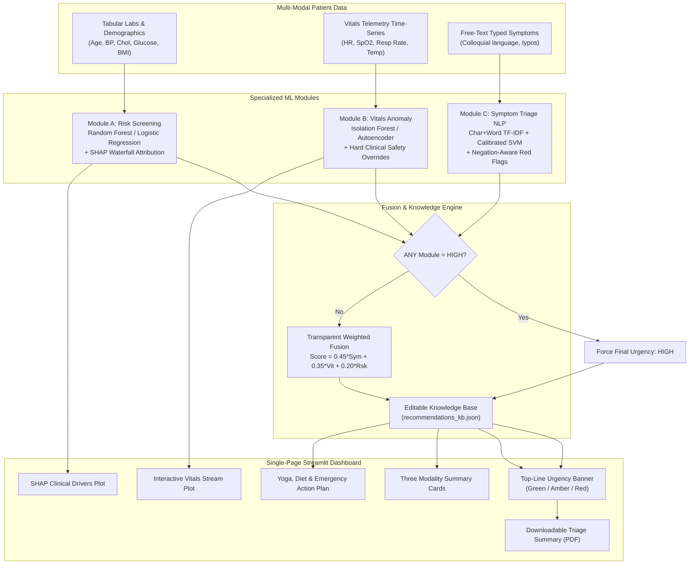

# Multi-Modal AI Medical Triage Dashboard 🏥

> **AI-Powered Clinical Decision-Support Prototype for Rural Healthcare Access**  
> *Aligned with United Nations Sustainable Development Goal 3: Good Health and Well-Being (Target 3.8: Universal Health Coverage)*

---

## 📌 Overview & Clinical Purpose

In rural clinics and primary health centers, community health workers often evaluate patients without on-site physicians. Differentiating self-limiting conditions from hidden emergencies is challenging. 

The **Multi-Modal AI Medical Triage Dashboard** is a unified, single-page Streamlit application that combines **3 distinct machine learning models** to evaluate:
1. **Module A (Tabular):** Patient chronic baseline risk for Heart Disease and Type 2 Diabetes with **SHAP explainability**.
2. **Module B (Time Series):** Continuous vital signs telemetry (Heart Rate, \(\text{SpO}_2\), RR, Temp) using **Isolation Forest** or **Reconstruction Autoencoder** with **hard clinical safety overrides**.
3. **Module C (NLP):** Free-text symptoms with negation handling (`no chest pain`), typo correction, emergency **red-flag overrides**, and **token-level word highlighting**.

The **Fusion Engine** synthesizes all three data streams into **ONE explained urgency score** (`LOW`, `MEDIUM`, or `HIGH`), complete with a 2-3 sentence clinical synthesis, actionable yoga/diet/exercise or emergency guidance from an editable JSON knowledge base, and downloadable clinical PDF reports.

> **⚠️ Regulatory Notice:** This is an experimental clinical decision-support prototype, **NOT** a diagnostic tool or replacement for a licensed physician.

---

## 🏗️ Architecture & Data Flow



---

## 📁 Project Structure

Designed for 4 teammates to develop independently without merge conflicts:

```
triage-dashboard/
├── app.py                     # Single-page Streamlit Dashboard entry point
├── config.py                  # Global thresholds, tiers, weights, and paths
├── requirements.txt           # Pinned dependencies
├── README.md                  # System overview and quick-start
├── data/                      # Persisted datasets
│   ├── heart_disease.csv
│   ├── pima_diabetes.csv
│   └── symptoms_labeled.csv   # 1,950 clinically labeled symptom sentences
├── models/                    # Serialized models and knowledge base
│   ├── heart_disease_model.joblib
│   ├── diabetes_model.joblib
│   ├── vitals_isoforest.joblib
│   ├── vitals_scaler.joblib
│   ├── vitals_autoencoder.joblib
│   ├── symptom_model.joblib
│   ├── symptom_vectorizer.joblib
│   └── recommendations_kb.json# Editable yoga, diet, exercise, and emergency KB
├── modules/
│   ├── risk_screening/        # Module A: Tabular risk + SHAP
│   ├── vitals_anomaly/        # Module B: Time-series vitals + Autoencoder
│   ├── symptom_triage/        # Module C: NLP triage + red flags + token highlights
│   └── fusion/                # Urgency Fusion & Recommendation Engine
├── dashboard/                 # UI components, high-contrast styles, and PDF generator
├── tests/                     # 27 comprehensive unit tests (100% pass rate)
└── docs/                      # Architecture diagrams, model cards, and write-up
```

---

## 🚀 Quick Start & Installation

### 1. Clone & Install Dependencies
```bash
cd triage-dashboard
pip install -r requirements.txt
```

### 2. Run the Dashboard
Launch the unified single-page application with one command:
```bash
streamlit run app.py
```
Open your browser to `http://localhost:8501`.

---

## 🧪 Training & Reproducibility

All training scripts feature fixed random seeds and automated model comparisons:

### Train Module C (Symptom Triage NLP)
```bash
python -m modules.symptom_triage.train
```
- Compares Baseline Logistic Regression vs. Calibrated Linear SVM.
- Prioritizes emergency HIGH tier recall (> 98%).

### Train Module A (Tabular Chronic Risk)
```bash
python -m modules.risk_screening.train
```
- Fetches UCI Heart Disease & Pima Indians Diabetes benchmarks (with calibrated fallbacks).
- Evaluates Random Forest vs. Logistic Regression, generating SHAP background baselines.

### Train Module B (Vitals Anomaly Telemetry)
```bash
python -m modules.vitals_anomaly.train
```
- Simulates multi-channel physiological baselines.
- Compares Isolation Forest vs. Bottleneck Reconstruction Autoencoder on injected anomalies.

---

## 🧪 Running Unit Tests

Run the complete test suite across all modules, safety overrides, and edge cases:
```bash
pytest tests/ -v
```
All **27 test cases pass cleanly**, covering:
- Standard dictionary output contract compliance across all modules
- Rule-based red-flag emergency overrides (chest pain, dyspnea, stroke signs)
- Natural language negation awareness (`no chest pain`, `denies shortness of breath`)
- Typo and colloquial spelling normalization
- Edge case handling (empty strings, random character gibberish, non-medical input)
- Hard clinical vitals boundaries (\(\text{SpO}_2 < 90\%\), \(\text{HR} > 140\), \(\text{HR} < 40\))
- Weighted fusion math and safety-override fail-safe gates
- Recommendation knowledge base querying and PDF export

---

## 👥 Three Benchmark Patients Walkthrough

The dashboard includes one-click preset buttons in the sidebar:

| Patient Profile | Symptoms | Vitals Telemetry | Chronic Labs | Overall Triage Result | Key Actions |
| :--- | :--- | :--- | :--- | :--- | :--- |
| **🟢 Patient 1 (LOW)** | "Mild runny nose, sneezing for 2 days, no fever" | Stable baseline (HR 74 bpm, \(\text{SpO}_2\) 98%) | Age 28, BP 115, Glucose 88, BMI 21.8 | **LOW (18%)** | Supportive home rest, Bhujangasana, hydration, balanced diet |
| **🟡 Patient 2 (MEDIUM)** | "Fever of 102F for 3 days with persistent abdominal cramping" | Septic fever spike (Temp 39.1°C, HR 112 bpm) | Age 54, BP 142, Glucose 175, BMI 29.5 | **MEDIUM (62%)** | Outpatient clinic visit within 24-48h, DASH low-sodium diet, Mandukasana |
| **🔴 Patient 3 (HIGH)** | "Crushing chest pain radiating down left arm, gasping for air" | Critical hypoxia & tachycardia (\(\text{SpO}_2\) 86%, HR 148 bpm) | Age 66, BP 178, Glucose 210, BMI 33.0 | **HIGH (100% Safety Override)** | **EMERGENCY (Call 112/108)**, immediate hospital transport, semi-upright rest |

---

## ⚖️ Ethical Considerations & Bias Mitigation

1. **Prioritizing Emergency Sensitivity:** In medical triage, false negatives (missing a critical patient) carry fatal consequences. Decision thresholds and class weights deliberately prioritize **Recall on the HIGH tier**.
2. **Negation Robustness:** Linguistic preprocessors prevent patients who report "mild headache, no chest pain" from being falsely sent to the emergency room.
3. **Transparent Explainability:** SHAP waterfall bar charts and token highlight boxes explain *why* an assessment was made, ensuring clinical decision support without opaque black boxes.
4. **Editable Knowledge Base:** Recommendations are stored in `models/recommendations_kb.json`, enabling local clinicians to adapt dietary tips and emergency numbers to local languages and customs without editing code.

---

## 📜 License & Disclaimers

Distributed for educational and humanitarian research under the MIT License. Aligned with UN SDG 3.
