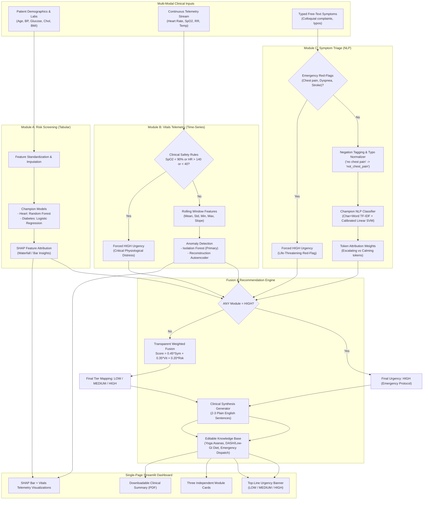

# Multi-Modal AI Medical Triage Dashboard: System Architecture

## 1. High-Level Architecture Overview

The Multi-Modal AI Medical Triage Dashboard is engineered as a decoupled, multi-modal decision-support system. It integrates three independent machine learning modules (tabular chronic disease screening, time-series physiological anomaly telemetry, and NLP free-text symptom triage) and synthesizes their predictions into a single, calibrated urgency tier and clinical explanation.



---

## 2. Standard Module Contract

Every module enforces a clean, decoupled interface returning a standard dictionary:

```python
{
    "module": str,                # "risk_screening" | "vitals_anomaly" | "symptom_triage"
    "urgency": "LOW" | "MEDIUM" | "HIGH",
    "score": float,               # 0.0 to 1.0 calibrated probability / anomaly index
    "explanation": str,           # Plain-English clinical rationale
    "details": dict               # Granular sub-scores, feature contributions, raw metrics
}
```

This strict schema guarantees that teammates can work independently on individual modules without merge friction or contract breaks.

---

## 3. Mathematical Fusion Specification

The final urgency score \( S_{\text{final}} \) combines the three modalities:

$$S_{\text{weighted}} = w_{\text{symptom}} \cdot S_{\text{symptom}} + w_{\text{vitals}} \cdot S_{\text{vitals}} + w_{\text{risk}} \cdot S_{\text{risk}}$$

Where the clinically prioritized weights are:
- \( w_{\text{symptom}} = 0.45 \) (Subjective acute clinical complaints)
- \( w_{\text{vitals}} = 0.35 \) (Objective real-time physiological status)
- \( w_{\text{risk}} = 0.20 \) (Long-term chronic background liability)

### Hard Clinical Safety Rule (Fail-Safe Override)
To prevent catastrophic algorithmic omissions:

$$\text{If } \max(U_{\text{symptom}}, U_{\text{vitals}}, U_{\text{risk}}) = \text{HIGH} \implies U_{\text{final}} = \text{HIGH}$$

$$S_{\text{final}} = \max(S_{\text{weighted}}, 0.85, S_{\text{symptom}}, S_{\text{vitals}}, S_{\text{risk}})$$
